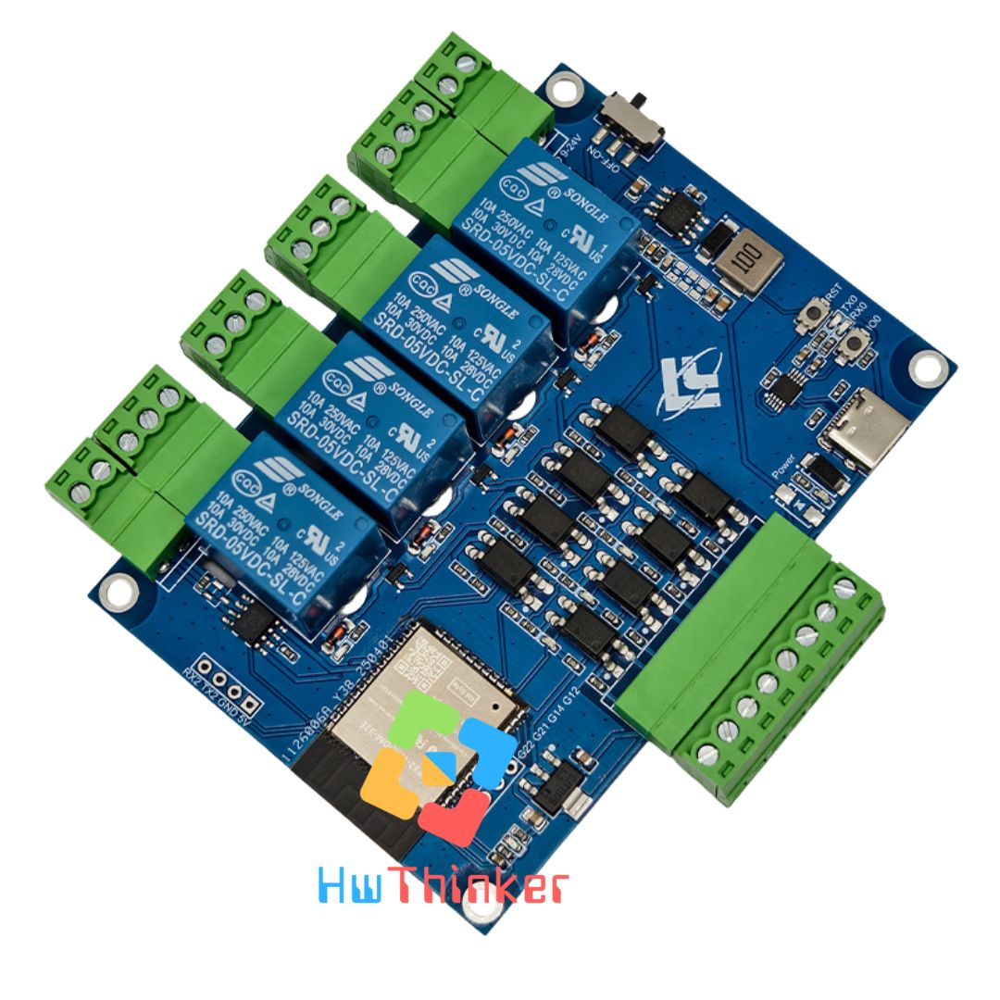
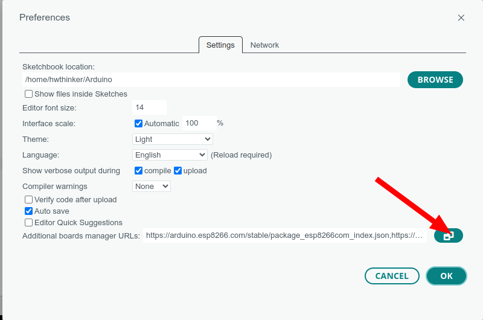
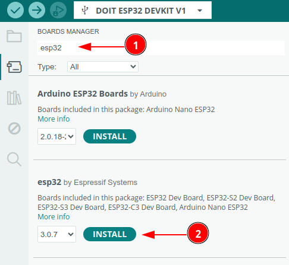
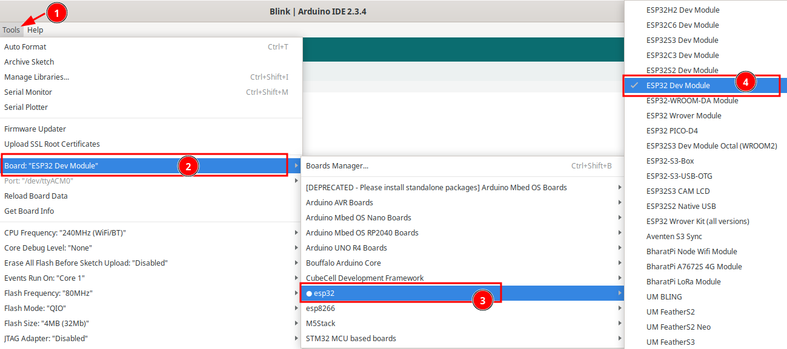
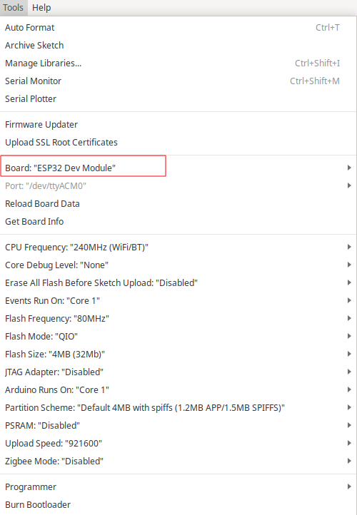

| Pin    | Function  |
| ------ | --------- |
| GPIO23 | Relay 1   |
| GPIO5  | Relay 2   |
| GPIO4  | Relay 3   |
| GPIO13 | Relay 4   |
| GPIO25 | Input 1   |
| GPIO26 | Input 2   |
| GPIO27 | Input 3   |
| GPIO33 | Input 4   |
| GPIO19 | ModBUS TX |
| GPIO18 | ModBUS RX |
| GPIO15 | LED       |
| GPIO16 | Pad RX2   |
| GPIO17 | Pad TX2   |

## Cara install plugin Arduino IDE

### Langkah 1: Buka Arduino IDE

1. Buka aplikasi Arduino IDE di komputer Anda. Jika belum ada, unduh dan instal Arduino IDE dari situs resmi Arduino di https://www.arduino.cc/en/software. disarankan menggunakan arduino ide versi 2

### Langkah 2: Tambahkan URL Board Manager untuk ESP32

1. Di Arduino IDE, buka **File** > **Preferences**.

   [

1. Pada bagian Additional Boards Manager URLs, tambahkan URL berikut:

```plain
<https://espressif.github.io/arduino-esp32/package_esp32_index.json>
```

1. Jika sebelumnya Anda sudah memiliki URL lain di sana, pisahkan URL ini dengan tanda koma atau baris baru.

[

### Langkah 3: Buka Boards Manager

1. Buka **Tools** > **Board** > **Boards Manager**.

[

1. Di kotak pencarian, ketik **ESP32**.

### Langkah 4: Instal Board ESP32

1. Temukan **ESP32 by Espressif Systems** di daftar, kemudian klik **Install**.

[

1. Tunggu hingga proses instalasi selesai.

### Langkah 5: Pilih Board ESP32

1. Setelah instalasi selesai, Anda dapat memilih board ESP32.

1. Buka **Tools** > **Board**, dan gulir ke bawah untuk menemukan berbagai jenis board ESP32 yang telah diinstal. Pilih board yang sesuai, misalnya **ESP32 Dev Module**

[

1. hasilnya kurang lebih seperti ini

[

### Langkah 6: Pilih Port

1. Sambungkan board ESP32 ke komputer Anda menggunakan kabel USB.

1. Di **Tools** > **Port**, pilih port yang sesuai dengan ESP32 Anda.

### Cara Upload Program

- Tekan dan tahan tombol IO0

- klik (tekan dan lepas) tombol RST dan pastikan tombol IO0 masih di tekan

- Lepas tombol IO0

- Download program dan tunggu sampai selesai

- klik tombol RST untuk run-program (langkah ini penting agar firmware baru dijalankan)

- ulang langkah awal bila melakukan download ulang lagi

  

Contoh kode program

```c++
const int RELAY1 = 23;
const int RELAY2 = 5;
const int RELAY3 = 4;
const int RELAY4 = 13;
const int INPUT1 = 25;
const int INPUT2 = 26;
const int INPUT3 = 27;
const int INPUT4 = 33;
const int LED = 15;

// ModBUS Serial (GPIO18 RX, GPIO19 TX)
#define MODBUS_RX 18
#define MODBUS_TX 19
HardwareSerial ModbusSerial(1);  // Serial1

// Serial2 (GPIO16 RX2, GPIO17 TX2)  
#define SERIAL2_RX 16
#define SERIAL2_TX 17
HardwareSerial PadSerial(2);     // Serial2

// Variabel status relay
bool relay1State = false;
bool relay2State = false;
bool relay3State = false;
bool relay4State = false;

// Variabel untuk debounce input
unsigned long lastDebounceTime = 0;
unsigned long debounceDelay = 50;

// Status sebelumnya input
int lastInput1State = HIGH;
int lastInput2State = HIGH;
int lastInput3State = HIGH;
int lastInput4State = HIGH;

void setup() {
  // Serial USB ke Komputer
  Serial.begin(9600);
  
  // ModBUS Serial (GPIO18 RX, GPIO19 TX)
  ModbusSerial.begin(9600, SERIAL_8N1, MODBUS_RX, MODBUS_TX);
  
  // Serial2 (GPIO16 RX2, GPIO17 TX2)
  PadSerial.begin(9600, SERIAL_8N1, SERIAL2_RX, SERIAL2_TX);
  
  // Setup relay pins sebagai OUTPUT
  pinMode(RELAY1, OUTPUT);
  pinMode(RELAY2, OUTPUT);
  pinMode(RELAY3, OUTPUT);
  pinMode(RELAY4, OUTPUT);
  
  // Setup input pins sebagai INPUT_PULLUP (AKTIF LOW)
  pinMode(INPUT1, INPUT_PULLUP);
  pinMode(INPUT2, INPUT_PULLUP);
  pinMode(INPUT3, INPUT_PULLUP);
  pinMode(INPUT4, INPUT_PULLUP);
  
  // Setup LED pin sebagai OUTPUT
  pinMode(LED, OUTPUT);
  
  // Matikan semua relay awal (HIGH = OFF - AKTIF LOW)
  digitalWrite(RELAY1, HIGH);
  digitalWrite(RELAY2, HIGH);
  digitalWrite(RELAY3, HIGH);
  digitalWrite(RELAY4, HIGH);
  
  // Matikan LED awal (HIGH = OFF - AKTIF LOW)
  digitalWrite(LED, HIGH);
  
  // RUNNING RELAY TEST DI AWAL
  runningRelayTest();
  
  // Kirim info ke semua serial
  broadcastMessage("ESP32 Interface Testing Started - ALL ACTIVE LOW");
  broadcastMessage("Serial USB: 9600 bps");
  broadcastMessage("ModBUS Serial: GPIO18(RX), GPIO19(TX) - 9600 bps");
  broadcastMessage("Serial2: GPIO16(RX2), GPIO17(TX2) - 9600 bps");
  
  printMenu();
}

void loop() {
  // Baca input dari semua serial
  if (Serial.available() > 0) {
    handleSerialCommand(Serial.readStringUntil('\n'), "USB");
  }
  
  if (ModbusSerial.available() > 0) {
    handleSerialCommand(ModbusSerial.readStringUntil('\n'), "ModBUS");
  }
  
  if (PadSerial.available() > 0) {
    handleSerialCommand(PadSerial.readStringUntil('\n'), "Serial2");
  }
  
  // Monitor input digital
  monitorInputs();
  
  delay(10);
}

// FUNGSI RUNNING RELAY TEST
void runningRelayTest() {
  broadcastMessage("=== RUNNING RELAY TEST ===");
  delay(1000);

  // All ON kemudian OFF
  broadcastMessage("All Relay ON...");
  digitalWrite(RELAY1, LOW);
  digitalWrite(RELAY2, LOW);
  digitalWrite(RELAY3, LOW);
  digitalWrite(RELAY4, LOW);
  delay(500);
  
  broadcastMessage("All Relay OFF...");
  digitalWrite(RELAY1, HIGH);
  digitalWrite(RELAY2, HIGH);
  digitalWrite(RELAY3, HIGH);
  digitalWrite(RELAY4, HIGH);
  delay(500);
  
    // All ON kemudian OFF
  broadcastMessage("All Relay ON...");
  digitalWrite(RELAY1, LOW);
  digitalWrite(RELAY2, LOW);
  digitalWrite(RELAY3, LOW);
  digitalWrite(RELAY4, LOW);
  delay(500);
  
  broadcastMessage("All Relay OFF...");
  digitalWrite(RELAY1, HIGH);
  digitalWrite(RELAY2, HIGH);
  digitalWrite(RELAY3, HIGH);
  digitalWrite(RELAY4, HIGH);
  delay(500);

broadcastMessage("Combined Running Effect 3x...");
  for(int cycle = 0; cycle < 2; cycle++) {
    // Kiri -> Kanan
    digitalWrite(RELAY1, LOW); delay(300); digitalWrite(RELAY1, HIGH);
    digitalWrite(RELAY2, LOW); delay(300); digitalWrite(RELAY2, HIGH);
    digitalWrite(RELAY3, LOW); delay(300); digitalWrite(RELAY3, HIGH);
    digitalWrite(RELAY4, LOW); delay(300); digitalWrite(RELAY4, HIGH);
    
    // Kanan -> Kiri  
    digitalWrite(RELAY4, LOW); delay(300); digitalWrite(RELAY4, HIGH);
    digitalWrite(RELAY3, LOW); delay(300); digitalWrite(RELAY3, HIGH);
    digitalWrite(RELAY2, LOW); delay(300); digitalWrite(RELAY2, HIGH);
    digitalWrite(RELAY1, LOW); delay(300); digitalWrite(RELAY1, HIGH);
  }

  // Update state variable
  relay1State = false;
  relay2State = false;
  relay3State = false;
  relay4State = false;
  broadcastMessage("=== RUNNING RELAY TEST SELESAI ===");
}

void handleSerialCommand(String command, String source) {
  command.trim();
  
  if (command == "1") {
    toggleRelay(RELAY1, "Relay 1", &relay1State, source);
  }
  else if (command == "2") {
    toggleRelay(RELAY2, "Relay 2", &relay2State, source);
  }
  else if (command == "3") {
    toggleRelay(RELAY3, "Relay 3", &relay3State, source);
  }
  else if (command == "4") {
    toggleRelay(RELAY4, "Relay 4", &relay4State, source);
  }
  else if (command == "a" || command == "A") {
    toggleAllRelays(source);
  }
  else if (command == "s" || command == "S") {
    readAllInputs(source);
  }
  else if (command == "r" || command == "R") {
    readAllRelays(source);
  }
  else if (command == "m" || command == "M") {
    printMenuToSource(source);
  }
  else if (command == "0") {
    turnOffAllRelays(source);
  }
  else if (command == "9") {
    turnOnAllRelays(source);
  }
  else if (command == "l" || command == "L") {
    testLED(source);
  }
  else if (command == "t" || command == "T") {
    // Perintah untuk running test manual
    runningRelayTest();
  }
  else if (command == "info") {
    sendToSource("Source: " + source, source);
  }
  else {
    sendToSource("Perintah tidak dikenali! Ketik 'M' untuk menu.", source);
  }
}

void toggleRelay(int relayPin, String relayName, bool *relayState, String source) {
  *relayState = !(*relayState);
  // AKTIF LOW: LOW = ON, HIGH = OFF
  digitalWrite(relayPin, *relayState ? LOW : HIGH);
  String message = relayName + " : " + (*relayState ? "ON" : "OFF") + " [From: " + source + "]";
  broadcastMessage(message);
}

void toggleAllRelays(String source) {
  relay1State = !relay1State;
  relay2State = !relay2State;
  relay3State = !relay3State;
  relay4State = !relay4State;
  
  // AKTIF LOW: LOW = ON, HIGH = OFF
  digitalWrite(RELAY1, relay1State ? LOW : HIGH);
  digitalWrite(RELAY2, relay2State ? LOW : HIGH);
  digitalWrite(RELAY3, relay3State ? LOW : HIGH);
  digitalWrite(RELAY4, relay4State ? LOW : HIGH);
  
  String message = "Semua Relay: " + String(relay1State ? "ON" : "OFF") + " [From: " + source + "]";
  broadcastMessage(message);
}

void turnOffAllRelays(String source) {
  relay1State = false;
  relay2State = false;
  relay3State = false;
  relay4State = false;
  
  // AKTIF LOW: HIGH = OFF
  digitalWrite(RELAY1, HIGH);
  digitalWrite(RELAY2, HIGH);
  digitalWrite(RELAY3, HIGH);
  digitalWrite(RELAY4, HIGH);
  
  String message = "Semua Relay: OFF [From: " + source + "]";
  broadcastMessage(message);
}

void turnOnAllRelays(String source) {
  relay1State = true;
  relay2State = true;
  relay3State = true;
  relay4State = true;
  
  // AKTIF LOW: LOW = ON
  digitalWrite(RELAY1, LOW);
  digitalWrite(RELAY2, LOW);
  digitalWrite(RELAY3, LOW);
  digitalWrite(RELAY4, LOW);
  
  String message = "Semua Relay: ON [From: " + source + "]";
  broadcastMessage(message);
}

void readAllInputs(String source) {
  String message = "=== STATUS INPUT (AKTIF LOW) ===\n";
  message += "Input 1 (GPIO25): " + getInputStatus(INPUT1) + "\n";
  message += "Input 2 (GPIO26): " + getInputStatus(INPUT2) + "\n";
  message += "Input 3 (GPIO27): " + getInputStatus(INPUT3) + "\n";
  message += "Input 4 (GPIO33): " + getInputStatus(INPUT4) + "\n";
  message += "=================================\n";
  message += "[Request From: " + source + "]";
  
  sendToSource(message, source);
}

String getInputStatus(int inputPin) {
  int state = digitalRead(inputPin);
  // AKTIF LOW: LOW = ACTIVE, HIGH = INACTIVE
  return state == LOW ? "ACTIVE (LOW)" : "INACTIVE (HIGH)";
}

void readAllRelays(String source) {
  String message = "=== STATUS RELAY (AKTIF LOW) ===\n";
  message += "Relay 1 (GPIO23): " + String(relay1State ? "ON (LOW)" : "OFF (HIGH)") + "\n";
  message += "Relay 2 (GPIO5): " + String(relay2State ? "ON (LOW)" : "OFF (HIGH)") + "\n";
  message += "Relay 3 (GPIO4): " + String(relay3State ? "ON (LOW)" : "OFF (HIGH)") + "\n";
  message += "Relay 4 (GPIO13): " + String(relay4State ? "ON (LOW)" : "OFF (HIGH)") + "\n";
  message += "=================================\n";
  message += "[Request From: " + source + "]";
  
  sendToSource(message, source);
}

void monitorInputs() {
  int currentInput1 = digitalRead(INPUT1);
  int currentInput2 = digitalRead(INPUT2);
  int currentInput3 = digitalRead(INPUT3);
  int currentInput4 = digitalRead(INPUT4);
  
  if (millis() - lastDebounceTime > debounceDelay) {
    if (currentInput1 != lastInput1State) {
      lastInput1State = currentInput1;
      String message = "Input 1 berubah: " + getInputStatus(INPUT1);
      broadcastMessage(message);
    }
    
    if (currentInput2 != lastInput2State) {
      lastInput2State = currentInput2;
      String message = "Input 2 berubah: " + getInputStatus(INPUT2);
      broadcastMessage(message);
    }
    
    if (currentInput3 != lastInput3State) {
      lastInput3State = currentInput3;
      String message = "Input 3 berubah: " + getInputStatus(INPUT3);
      broadcastMessage(message);
    }
    
    if (currentInput4 != lastInput4State) {
      lastInput4State = currentInput4;
      String message = "Input 4 berubah: " + getInputStatus(INPUT4);
      broadcastMessage(message);
    }
    
    lastDebounceTime = millis();
  }
}

void testLED(String source) {
  sendToSource("Testing LED (AKTIF LOW)...", source);
  
  // AKTIF LOW untuk LED: LOW = ON, HIGH = OFF
  // LED ON
  digitalWrite(LED, LOW);
  sendToSource("LED ON (LOW)", source);
  delay(1000);
  
  // LED OFF
  digitalWrite(LED, HIGH);
  sendToSource("LED OFF (HIGH)", source);
  delay(1000);
  
  // LED ON kembali
  digitalWrite(LED, LOW);
  sendToSource("LED ON (LOW) kembali - Test selesai", source);
}

void broadcastMessage(String message) {
  Serial.println(message);
  ModbusSerial.println(message);
  PadSerial.println(message);
}

void sendToSource(String message, String source) {
  if (source == "USB") {
    Serial.println(message);
  } else if (source == "ModBUS") {
    ModbusSerial.println(message);
  } else if (source == "Serial2") {
    PadSerial.println(message);
  }
}

void printMenu() {
  broadcastMessage("\n=== TESTING INTERFACE ESP32 ===");
  broadcastMessage("KONFIGURASI: SEMUA I/O AKTIF LOW");
  broadcastMessage("RELAY & LED: LOW = ON, HIGH = OFF");
  broadcastMessage("INPUT: LOW = ACTIVE, HIGH = INACTIVE");
  broadcastMessage("Available Serial Interfaces:");
  broadcastMessage("1. USB Serial (Default)");
  broadcastMessage("2. ModBUS: GPIO18(RX), GPIO19(TX)");
  broadcastMessage("3. Serial2: GPIO16(RX2), GPIO17(TX2)");
  broadcastMessage("Perintah Serial:");
  broadcastMessage("1 - Toggle Relay 1 (GPIO23)");
  broadcastMessage("2 - Toggle Relay 2 (GPIO5)");
  broadcastMessage("3 - Toggle Relay 3 (GPIO4)");
  broadcastMessage("4 - Toggle Relay 4 (GPIO13)");
  broadcastMessage("A - Toggle Semua Relay");
  broadcastMessage("0 - Matikan Semua Relay");
  broadcastMessage("9 - Nyalakan Semua Relay");
  broadcastMessage("S - Baca Status Semua Input");
  broadcastMessage("R - Baca Status Semua Relay");
  broadcastMessage("L - Test LED (GPIO15)");
  broadcastMessage("T - Running Relay Test");
  broadcastMessage("M - Tampilkan Menu ini");
  broadcastMessage("INFO - Tampilkan source connection");
  broadcastMessage("==============================");
}

void printMenuToSource(String source) {
  String menu = "\n=== TESTING INTERFACE ESP32 ===\n";
  menu += "KONFIGURASI: SEMUA I/O AKTIF LOW\n";
  menu += "RELAY & LED: LOW = ON, HIGH = OFF\n";
  menu += "INPUT: LOW = ACTIVE, HIGH = INACTIVE\n";
  menu += "Available Serial Interfaces:\n";
  menu += "1. USB Serial (Default)\n";
  menu += "2. ModBUS: GPIO18(RX), GPIO19(TX)\n";
  menu += "3. Serial2: GPIO16(RX2), GPIO17(TX2)\n";
  menu += "Perintah Serial:\n";
  menu += "1 - Toggle Relay 1 (GPIO23)\n";
  menu += "2 - Toggle Relay 2 (GPIO5)\n";
  menu += "3 - Toggle Relay 3 (GPIO4)\n";
  menu += "4 - Toggle Relay 4 (GPIO13)\n";
  menu += "A - Toggle Semua Relay\n";
  menu += "0 - Matikan Semua Relay\n";
  menu += "9 - Nyalakan Semua Relay\n";
  menu += "S - Baca Status Semua Input\n";
  menu += "R - Baca Status Semua Relay\n";
  menu += "L - Test LED (GPIO15)\n";
  menu += "T - Running Relay Test\n";
  menu += "M - Tampilkan Menu ini\n";
  menu += "INFO - Tampilkan source connection\n";
  menu += "==============================";
  
  sendToSource(menu, source);
}
```

## Pemecahan Masalah

### A. Port Com tidak dapat dikenali di Arduino

Masuk ke mode unduh:

- Tekan dan tahan tombol Boot/0

- Klik(tekan dan lepas) tombol reset/EN sambil tetap tekan tombol Boot .

- Lepas tombol boot

- Setelah selesai Wajib klik tombol **reset** sekali lagi untuk berpindah dari mode download menjadi mode run

### B. Program tidak dapat berjalan setelah diunggah

Setelah upload berhasil, Anda perlu menekan tombol Reset sebelum dapat dijalankan.


## Referensi

- https://devices.esphome.io/devices/ESP32_Relay_X4_Modbus_v1.3

  